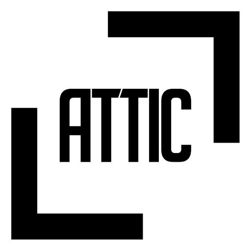

<h1 align="center">
  <br>
    
  <br>
    Codename: ATTIC
  <br>
</h1>

<h4 align="center">Organizing and securely holding your family memories</h4>

ATTIC stores everything related to family media and documents optimized for long-term storage, complex searching/viewing, and precise sharing within your family network. This includes storing all forms of video, images, and computer documents. If it can be digitized, it can be stored in ATTIC.

Previously we stored everything physically in albums or boxes. These memories took the form of developed photos, VHS cassettes, printed copies of documents, and any other number of media formates. These are not only inaccessible today due to the lack of hardware such as VCRs, but are also stored in a "lossy" format that [degrades over time](https://www.youtube.com/watch?v=Ef7A0-gpwn4). If something is not done, these memories will be destroyed simply due to time.

Today we create and share all of our memories digitally, but we ironically don't have a good place for storing them for the long term. Social networks are optimized for social sharing, and as such their platforms are built to meet that end goal - despite them having copies of everything you share.

ATTIC is like the box in your attic full of all your memories sitting there quietly until it's wanted, but with some upgrades.

- Your memories never degrade. Once digitized, it doesn't lose quality over time. Hurricane Harvey can't take your photo albums from you.
- Entire boxes - or just parts of them - can be stored in multiple "attics" at once. Imagine granting other people modular access to specific memories that are customized for you, your kids, your parents, your cousins; anyone those memories are relevant to.
- Complex searching and retrieval of memories. Are you looking for videos of both Sarah and Jim but without Dave, taken in Arizona during the late 80s? No problem. How about all journal entries written by your grandfather that specifically mention your dad? Or everything created on June 13, 1988? Get exactly what you're looking for with just as much fuzziness or precision as you need.
- Share digital copies of important legal documents - such as a birth certificate or high-school transcript - with your kid at college without needing to send the physical copy.
- Keep track of the physical location of the source memory. Quickly look up the digital copy of your great-grandmother's house title and find the physical location of the document. Now you can skip the last-minute flight to Germany, nor do you need to spend days searching aimlessly through every box in her closet once you get there.

## Project Stack

ATTIC is built on the [GRANDstack](https://grandstack.io/):

- **[Neo4j](https://neo4j.com/product/)** - The open source native graph database
- **[Node.js](https://nodejs.org/en/)** - JavaScript runtime built on Chrome's V8 JavaScript engine
- **[GraphQL](https://graphql.org/)** - A new paradigm for building APIs, GraphQL is a way of describing data and enabling clients to query it
- **[Apollo](https://www.apollographql.com/)** - A suite of tools that work together to create great GraphQL workflows
- **[React](https://reactjs.org/)** - A JavaScript library for building user interfaces
- **[Google Cloud Storage](https://cloud.google.com/storage/)** - Google Cloud Storage is unified object storage for developers and enterprises
- **[Transloadit](https://transloadit.com/)** - The world’s most advanced file uploading and processing service
- **[Uppy](https://uppy.io/)** - Advanced and user-friendly bulk document uploading

<!-- 
## Installing / Getting started

A quick introduction of the minimal setup you need to get a hello world up &
running.

```shell
packagemanager install awesome-project
awesome-project start
awesome-project "Do something!"  # prints "Nah."
```

Here you should say what actually happens when you execute the code above.

### Initial Configuration

Some projects require initial configuration (e.g. access tokens or keys, `npm i`).
This is the section where you would document those requirements.

## Developing

Here's a brief intro about what a developer must do in order to start developing
the project further:

```shell
git clone https://github.com/your/awesome-project.git
cd awesome-project/
packagemanager install
```

And state what happens step-by-step.

### Building

If your project needs some additional steps for the developer to build the
project after some code changes, state them here:

```shell
./configure
make
make install
```

Here again you should state what actually happens when the code above gets
executed.

### Deploying / Publishing

In case there's some step you have to take that publishes this project to a
server, this is the right time to state it.

```shell
packagemanager deploy awesome-project -s server.com -u username -p password
```

And again you'd need to tell what the previous code actually does.

## Features

What's all the bells and whistles this project can perform?
* What's the main functionality
* You can also do another thing
* If you get really randy, you can even do this

## Configuration

Here you should write what are all of the configurations a user can enter when
using the project.

#### Argument 1
Type: `String`  
Default: `'default value'`

State what an argument does and how you can use it. If needed, you can provide
an example below.

Example:
```bash
awesome-project "Some other value"  # Prints "You're nailing this readme!"
```

#### Argument 2
Type: `Number|Boolean`  
Default: 100

Copy-paste as many of these as you need.

## Contributing

When you publish something open source, one of the greatest motivations is that
anyone can just jump in and start contributing to your project.

These paragraphs are meant to welcome those kind souls to feel that they are
needed. You should state something like:

"If you'd like to contribute, please fork the repository and use a feature
branch. Pull requests are warmly welcome."

If there's anything else the developer needs to know (e.g. the code style
guide), you should link it here. If there's a lot of things to take into
consideration, it is common to separate this section to its own file called
`CONTRIBUTING.md` (or similar). If so, you should say that it exists here.

## Links

Even though this information can be found inside the project on machine-readable
format like in a .json file, it's good to include a summary of most useful
links to humans using your project. You can include links like:

- Project homepage: https://your.github.com/awesome-project/
- Repository: https://github.com/your/awesome-project/
- Issue tracker: https://github.com/your/awesome-project/issues
  - In case of sensitive bugs like security vulnerabilities, please contact
    my@email.com directly instead of using issue tracker. We value your effort
    to improve the security and privacy of this project!
- Related projects:
  - Your other project: https://github.com/your/other-project/
  - Someone else's project: https://github.com/someones/awesome-project/


## Licensing

One really important part: Give your project a proper license. Here you should
state what the license is and how to find the text version of the license.
Something like:

"The code in this project is licensed under MIT license."
 -->